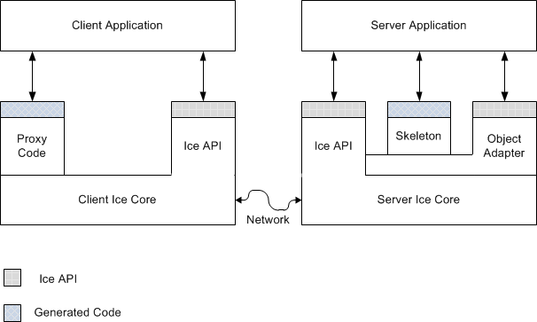
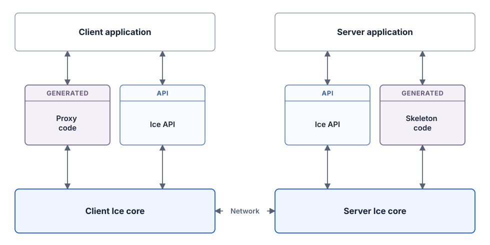
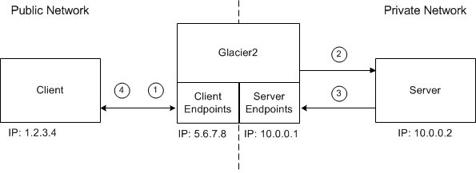
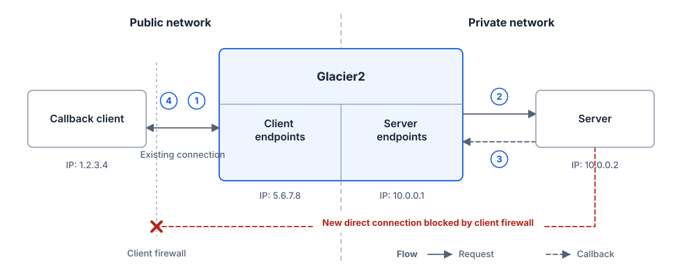
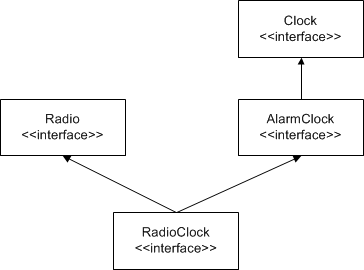
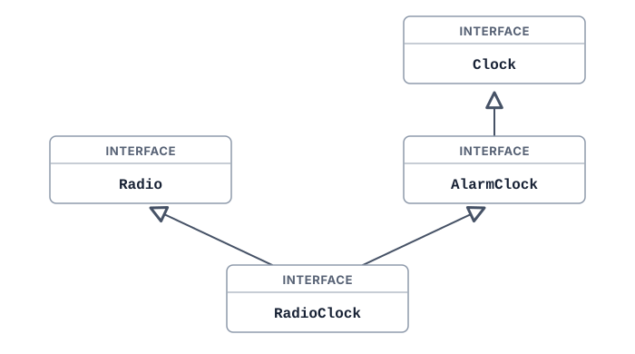
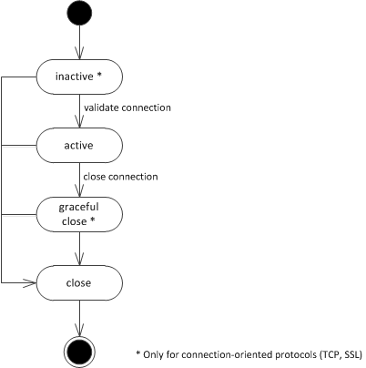
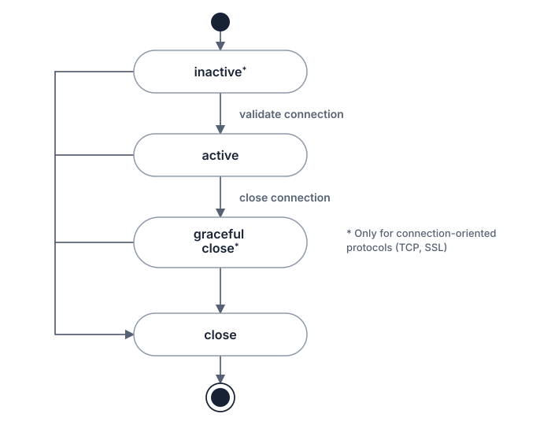
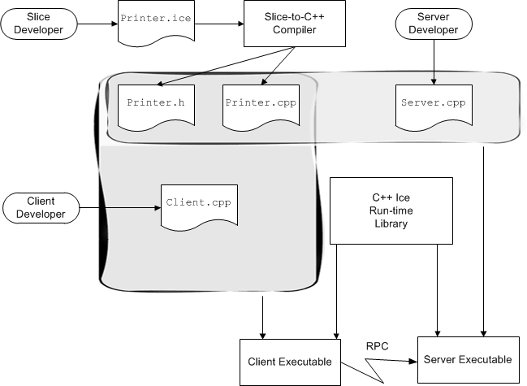
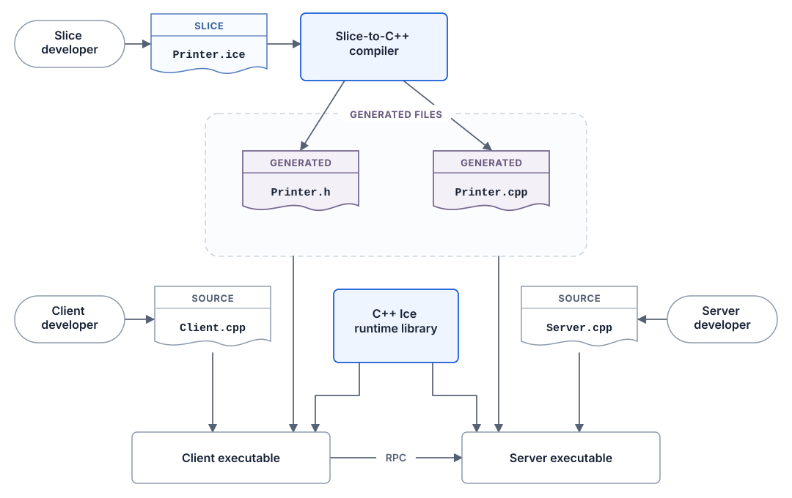

# SVG pilot review material

These comparison files support review of the direct-SVG pilot. The canonical SVGs live beside the
documentation assets under `public/attachments/`; the files in this directory are not published by
the documentation site.

## Local review pages

Start the documentation server on port 3101, then open:

| Figure                      | Local page                                                                   |
| --------------------------- | ---------------------------------------------------------------------------- |
| Client and server structure | <http://localhost:3101/ice/3.8/cpp/basics>                                   |
| Callback through Glacier2   | <http://localhost:3101/ice/3.8/cpp/callbacks-through-glacier2>               |
| Interface inheritance       | <http://localhost:3101/ice/3.8/cpp/interface-inheritance>                    |
| Protocol state machine      | <http://localhost:3101/ice/3.8/cpp/protocol-messages#protocol-state-machine> |
| Slice compilation           | <http://localhost:3101/ice/3.8/cpp/slice-compilation>                        |

## Rendered-page screenshots

The screenshots below were captured from the local server at a 1440-pixel viewport. They show the
new SVG in its documentation context, including the available content-column width and caption.

- [Client and server structure](screenshots/client-server-page.png)
- [Callback through Glacier2](screenshots/callback-via-glacier2-page.png)
- [Interface inheritance](screenshots/radioclock-page.png)
- [Protocol state machine](screenshots/protocol-state-machine-page.png)
- [Slice compilation](screenshots/slice-compilation-page.png)

## Original and replacement

### Client and server structure

| Original GIF                                                                                   | Direct SVG                                                                                |
| ---------------------------------------------------------------------------------------------- | ----------------------------------------------------------------------------------------- |
|  |  |

### Callback through Glacier2

| Original GIF                                                                                                          | Direct SVG                                                                                                       |
| --------------------------------------------------------------------------------------------------------------------- | ---------------------------------------------------------------------------------------------------------------- |
|  |  |

### Interface inheritance

| Original GIF                                                                                                  | Direct SVG                                                                                               |
| ------------------------------------------------------------------------------------------------------------- | -------------------------------------------------------------------------------------------------------- |
|  |  |

### Protocol state machine

| Original GIF                                                                                                  | Direct SVG                                                                                               |
| ------------------------------------------------------------------------------------------------------------- | -------------------------------------------------------------------------------------------------------- |
|  |  |

### Slice compilation

| Original GIF                                                                                                | Direct SVG                                                                                             |
| ----------------------------------------------------------------------------------------------------------- | ------------------------------------------------------------------------------------------------------ |
|  |  |

## Client and server design comparisons

The selected three-layer diagram is the published SVG. The additional SVG in this directory records
the containment-based alternative considered during the pilot.
